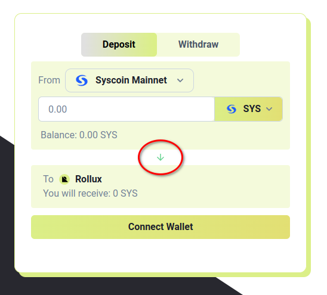
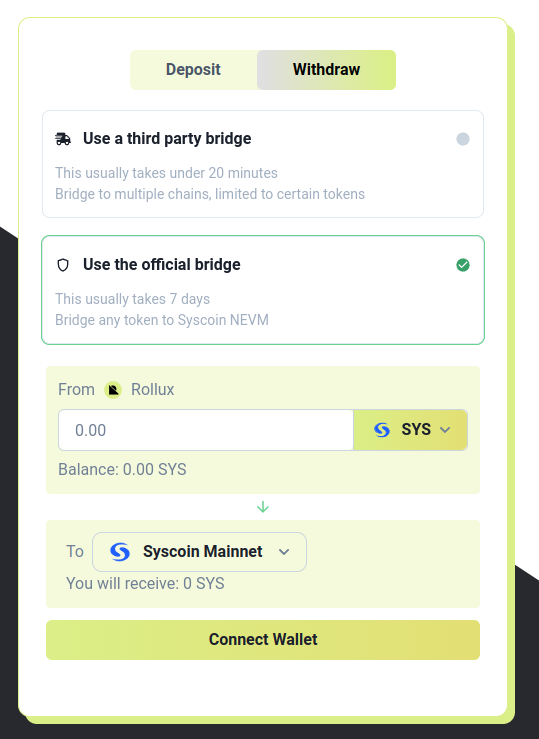

Rollux Portal is Rollux's official canonical bridge. It offers a very easy and safe way to move your SYS or other assets between Syscoin Mainnet (L1) and Rollux (L2).

## How to move SYS or assets from Syscoin Mainnet (L1) to Rollux

Watch this video for a simple demonstration. This bridge is relatively fast. It only takes one block confirmation on L1 for your asset(s) to arrive on Rollux.  

<iframe width="720" height="407" src="https://www.youtube.com/embed/F6hWvG2OXVo" title="How to use Rollux Portal" frameborder="0" allow="accelerometer; autoplay; clipboard-write; encrypted-media; gyroscope; picture-in-picture; web-share" allowfullscreen></iframe>

## How to move SYS or assets from Rollux back to Syscoin NEVM (L1)

1. To switch directions, click the green arrow that is annotated in the red circle below.  The portal will then show "From: Rollux" and "To: Syscoin Mainnet".

2. Now choose whether to use the Rollux official bridge to move your value, or a third-party bridge. Keep in mind, when moving value from Rollux back to Syscoin Mainnet using the official bridge there is a security period which takes 7 days. This waiting period is an artifact of all Optimistic Rollups. Third-party services can provide a much faster bridging service when moving from Rollux back to Syscoin, but you choose to use them at your own risk.

For this demonstration we select "Use the official bridge".

3. Now proceed as normal.  Select which asset you want to bridge back to Syscoin, enter the amount, and click the button. 